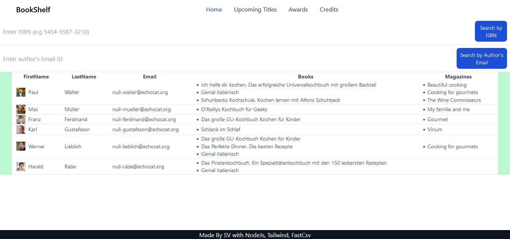

<h1 align="center">BookShelf App</h1>
<h3 align="center"> using <b>Node.JS</b>, <b>Express</b>, <b>TailwindCSS</b>, <b>Fast-CSV library</b>, and <b>Ejs</b></h3>
  
  

    

## Features

<ul>
<li>Reads the CSV data from Files</li>
<li>Get details of all books and magazines by its ISBN, or Author's emailID
</li>
<li>Add book's complete details including title, ISBN, author, description and export to its existing csv file</li>
<li>Add magazine's complete details including title, ISBN, author, published date and export to its existing csv file</li>
</ul>
